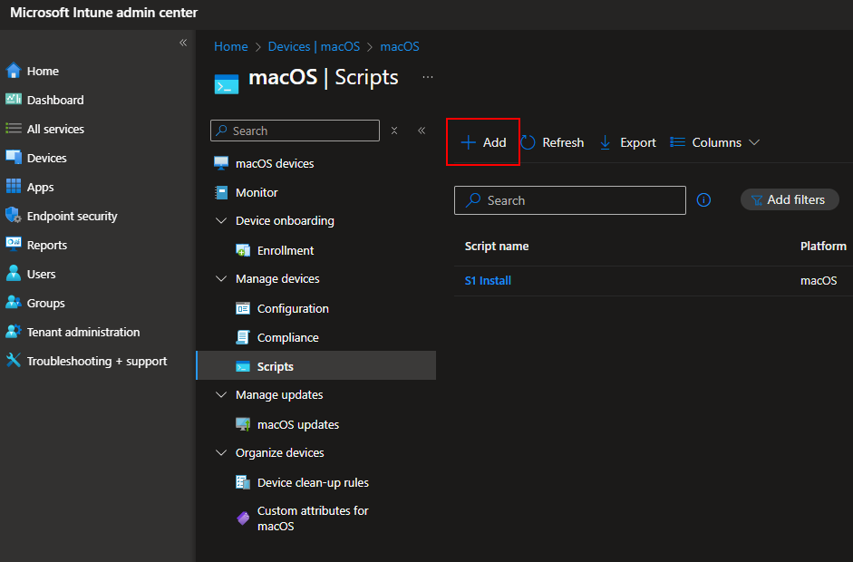
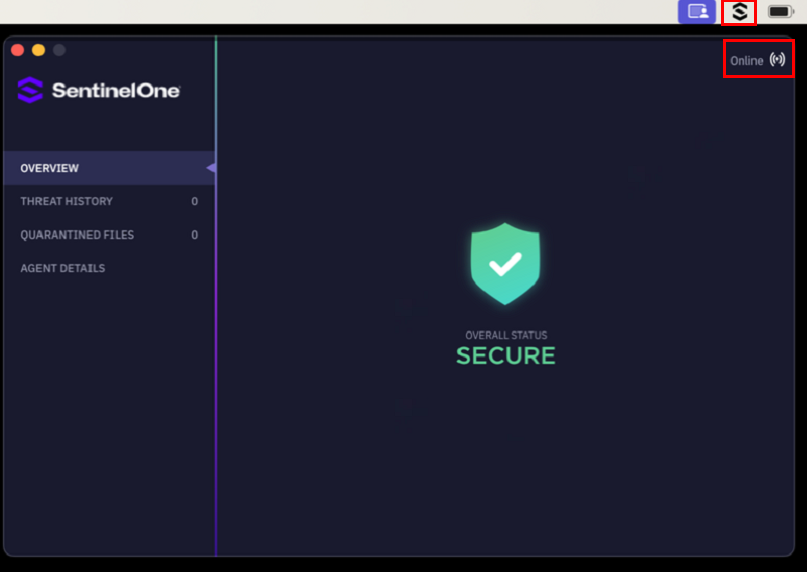

# The following article is an explanation of how to deploy SentinelOne to a MAC using Intune and also do some configurations

First step will be to install sentinel 1, for this method we will be utilizing an azure storage account to host the .PKG file. I will admit that you can do this without a storage account and do this within Application Deployment but by utilizing this method the deployment in some ways is more efficient.

You will need an install [script](https://github.com/edtechjeff/edtechjeff/blob/main/HowTo/Intune/SentinelOneMAC/InstallSentinel.sh).

Now you will need to edit the file to reflect your instance of SentinelOne

#####################################################################################

#!/bin/sh
siteToken="xxxxxxxxxxxxxxxxxxxxxxxxxxxxxxxxxxxxxxxxxxxxxxx"
installerurl="https://yourstorageaccount.blob.core.windows.net/test/Sentinel-Release-24-2-2-7632_macos_v24_2_2_7632.pkg"
installer="Sentinel-Release-24-2-2-7632_macos_v24_2_2_7632.pkg"
dir="/tmp/"
tokenfile="com.sentinelone.registration-token"

if [ -d /Applications/SentinelOne/ ];
then
  echo "SentinelOne is already Installed"
  exit 0

else
#Download installer into tmp directory
curl -L -o $dir$installer $installerurl

#Create Site Token File
echo $siteToken > $dir$tokenfile

#Install Agent
/usr/sbin/installer -pkg $dir$installer -target /

#Cleanup token file
rm -f $dir$tokenfile
fi

#####################################################################################

Now that you have the script lets switch into Intune > Devices > MAC > Scripts and create a new script

*Reason we are doing scripts instead of application deployment is that with scripts you can control how often it will go out and try and that makes the deployment more efficient than application deployments*

Provide a name, and under script settings, browse to the script file to upload the contents. Select No to run the script as signed-in user. Modify the notifications and script frequency to your liking.

Assign to your groups, and wait for them to check in and get the installer. When the app gets installed on the user devices, they’ll see some notifications about background items:

With that being all done, SentinelOne is now installed but not configured. 

After devices start reporting that the script was successfully executed, you will see results in the device status that the install was successful:

If the following task are not completed via Intune then the user or a computer tech will have to do these manually, now who wants that!! 

If you do not have it configured on the MAC correctly you will get some messages. See below as an example

To avoid these we are going to push out profiles to the devices

Deploying the Necessary Profiles
As we mentioned at the end of the previous section, some necessary profiles must be pushed to the devices so SentinelOne can properly protect them. Although the SentinelOne KB does not have any documentation on using Intune, they do have documentation on using jamf. We can use the same configuration files and deploy them with Intune. There are four profiles we need to deploy:

1. Network Monitoring
2. Privacy Control
3. Notifications
4. Network Filtering

These are available as .mobileconfig files here, or you can get them from SentinelOne’s KB if you have access to their dashboard. For each of these files, we need to create a custom device configuration policy in Intune. From Intune, navigate to devices > macos > configuration. Click Add