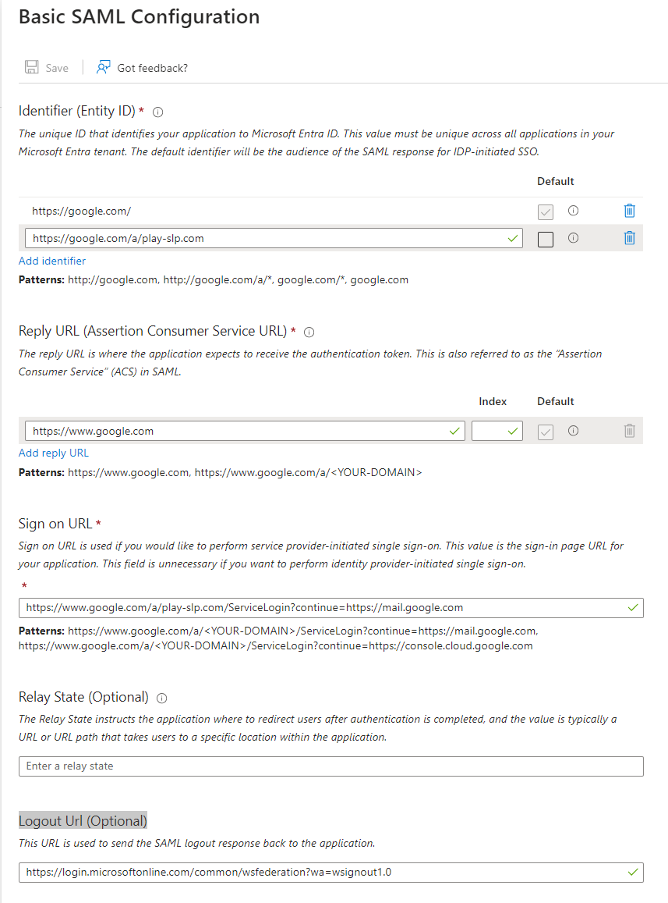
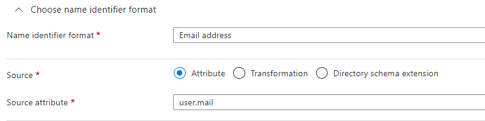
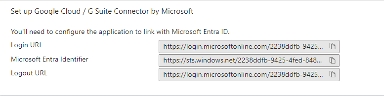

# SSO Google Workspaces

* Please note, this is a work in progress as of *1/18/2025* I will continue to look at this because the documentation on both sides of Google and Microsoft are a little bit confusing. The goal of this document will be to have a more comprehensive document to help others in the future. Please stay tuned. 

Documents used as reference
* https://support.google.com/a/answer/12032922?hl=en&visit_id=638727404915468108-289911806&p=sso_profiles&rd=1#legacy_saml_deprecation&zippy=%2Cconfigure-the-legacy-sso-profile
* https://learn.microsoft.com/en-us/entra/identity/saas-apps/google-apps-tutorial
* https://cloud.google.com/architecture/identity/federating-gcp-with-azure-ad-configuring-provisioning-and-single-sign-on

## Basic SAML Configuration

Identifier (Entity ID)

https://google.com/a/play-slp.com

Reply URL (Assertion Consumer Service URL)

https://www.google.com

Sign on URL
https://www.google.com/a/play-slp.com/ServiceLogin?continue=https://mail.google.com

Logout Url (Optional)

https://login.microsoftonline.com/common/wsfederation?wa=wsignout1.0

## Attributes Claims

Unique User Identifier          user.mail

## Download Cert

## URLS for Google Side

Login URL: https://login.microsoftonline.com/2238ddfb-9425-4fed-8482-c2cdef1a8793/saml2

Microsoft Entra Identifier: (*Get from Application*)

Logout URL: https://login.microsoftonline.com/common/wsfederation?wa=wsignout1.0

Change Password URL: https://mysignins.microsoft.com/security-info/password/change

