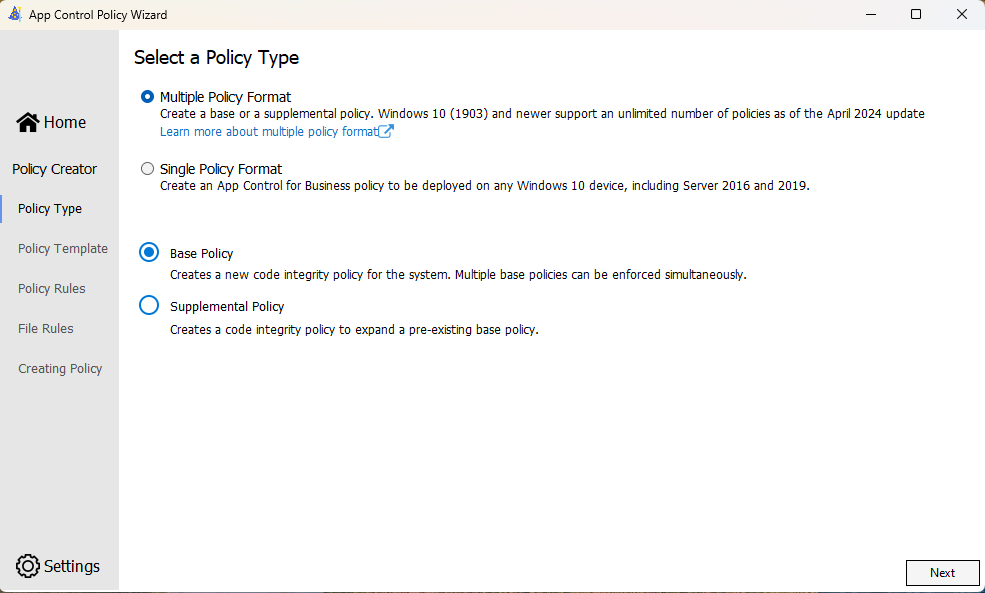
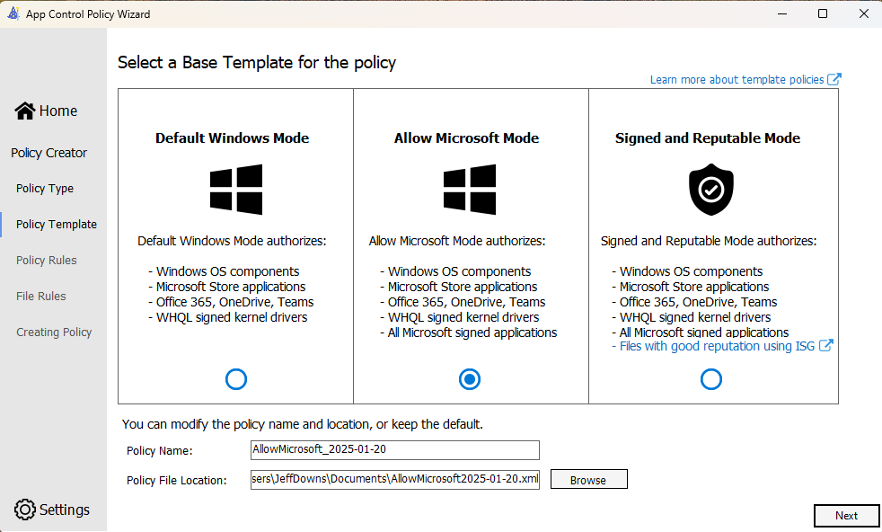
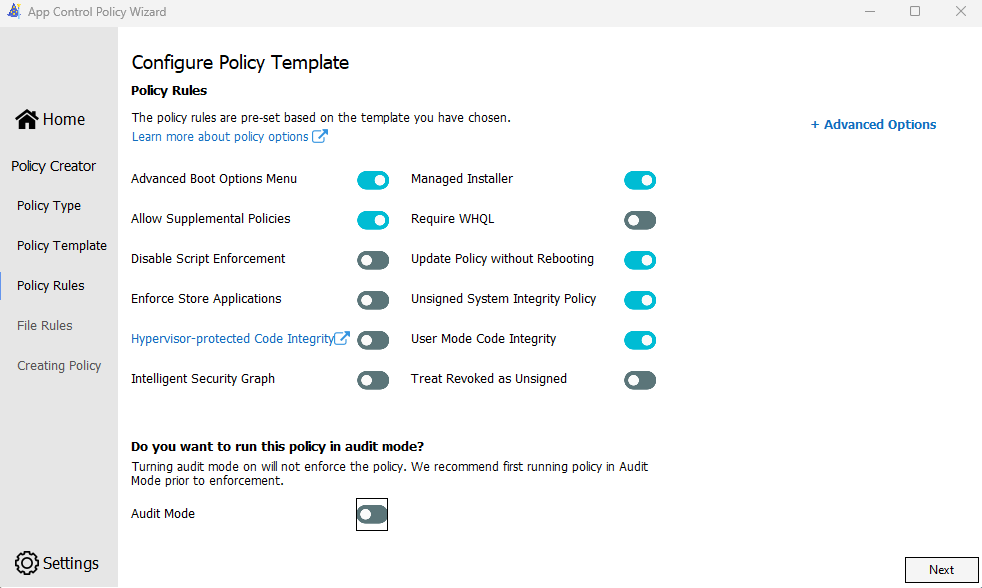
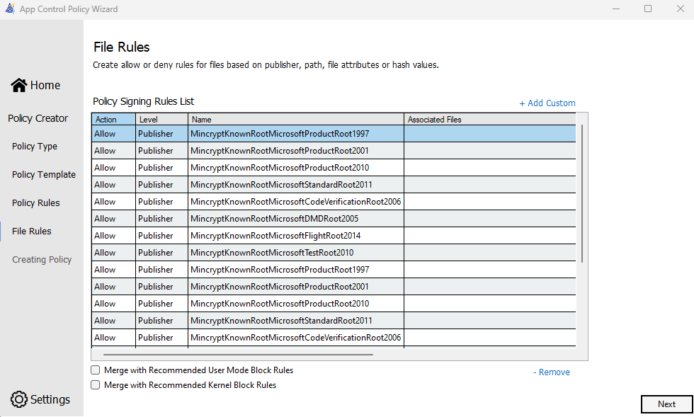
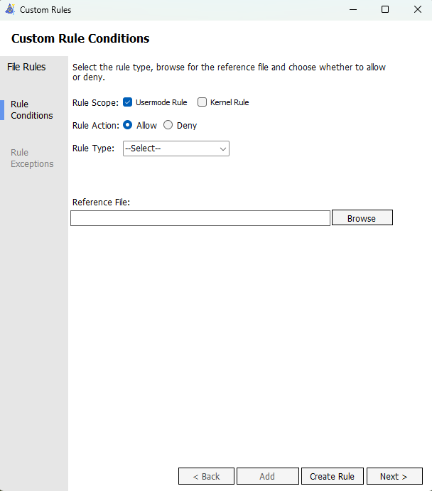
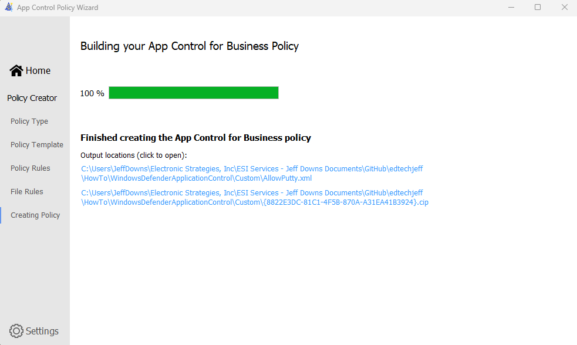

# Intune Windows Defender Application Control

## Useful Links
* https://learn.microsoft.com/en-us/windows/security/application-security/application-control/app-control-for-business/design/appcontrol-wizard-create-base-policy
* https://learn.microsoft.com/en-us/windows/security/application-security/application-control/app-control-for-business/design/example-appcontrol-base-policies

# Warning, depending on what you are setting this could block out the device to the point where you might have to reset the device. BE CAREFUL

## Before you being
* Test group for deployment
* Test machine for deployment
* Reference machine for policy creation
* Add machine to test deployment group
* Download and install the App Control Wizard https://webapp-wdac-wizard.azurewebsites.net/
* Test Application (Putty will be example for this POC)

## Create Base Policy on reference machine
Launch the App Control Wizard and click on Policy Creator

Click next and leave the defaults

Here you have 3 options. My professional opinion is it goes from left to right most restrictive to least restrictive. I have worked with the different settings and I do feel like the Allow Microsoft Mode is a good place to start and go from there depending on your applications. These policies do have already built in allows that can make things easier.  Also in this link [here](https://learn.microsoft.com/en-us/windows/security/application-security/application-control/app-control-for-business/design/example-appcontrol-base-policies) are some Microsoft pre-built policies to also try out. But for me I am going to build my own. Select the option you would like give the policy a location and name you would like to name it and click next.

Here you will need to slide over Managed installer and also turn audit mode off. I would suggest Audit mode the first time just to cover yourself. Click Next

Here you will see all the rules and also where you can add additional rules

Click on Add Custom

For this example we are going to do a Rule Type of Publisher. In the links provided it details about the different types. I am going to open it up a little bit and only need the Issuing CA and Publisher to match. Click Next 

Here is the result of what you just did, Click Next it will start to build the policy

Final screen you can now close the wizard

## Intune Policies