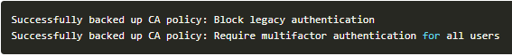
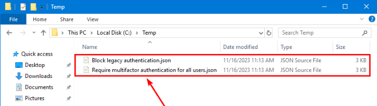
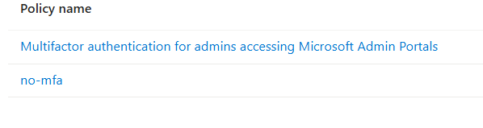

# Import and Export Policies (Conditional Access and Intune)

---
## [Export-intune-all.ps1](export-intune-all.ps1)
This PowerShell script will export all polices out of Intune which include
- Compliance policies
- Configuration policies
- Endpoint Security policies
- Managed app policies

## In order for this to work you will need to create an application registration and give it the following permissions
- DeviceManagementApps.ReadWrite.All
- DeviceManagementConfiguration.ReadWrite.All
- DeviceManagementServiceConfig.ReadWrite.All

## After you create the application you will need to go into secrets and create one and copy the secret password

## You will need to know the following information when you run the script
- Client ID
- Client Secret
- Tenant ID
- Output location

## When you run the script it will output 

## Now you should have all your configurations downloaded and viewable in JSON format

---
# [Import Policies](Import-Intune-Policies.ps1)
Run the script in order to import the policies

## Couple of Notes
- *Its important to know that if you have the same policy name it will import it with the same name unless you change the name in the JSON. Also note these will not assign but will make things more efficient for you.*
- *If you just want to do, for example application policies move just the application policies to their own sub folder and in the script when it ask where point it to that sub folder*
- *You will need to know all the App Registration information just like in the export steps*

---
# [Export Conditional Access Policies](export-ca.ps1)
This script will export out all the Conditional Access Policies

## Install Microsoft Graph PowerShell
Install-Module Microsoft.Graph -Force

## Have 2 directories to run the scripts out of, your choice
- Scripts
    - Output

## Download the script and put it in the scripts folder

## Run the script

## Open up your output folder and there will be your exported CA's

---
# [Export Conditional Access Policies](export-ca.ps1)
This script will import Conditional Access Policies
Couple of Notes
- *If you just want to do one, just have what CA's you want to restore in the OUTPUT folder* 

## Install Microsoft Graph PowerShell
Install-Module Microsoft.Graph -Force

## Have 2 directories to run the scripts out of, your choice
- Scripts
    - Output

## Download the script and put it in the scripts folder

## Run the script

## Now your CA's are there

# Final Thoughts
## Scripts can be great and save you a ton of time. These can be used by anyone to have backups of what you are doing. Use them as change control. You are about to make a change, download them and save them off. Make your changes and if something is wrong delete it and restore the old. 