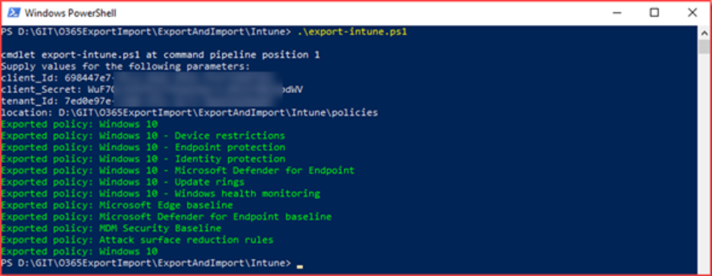
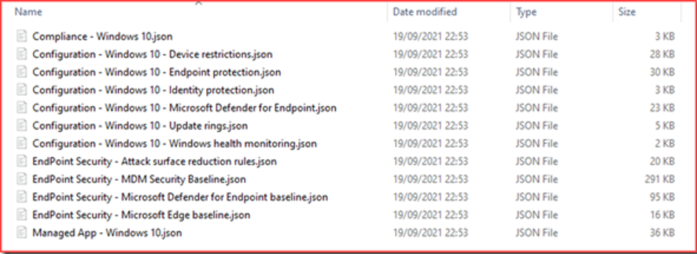

# Import and Export Policies (Conditional Access and Intune)

---
## Export-intune-all.ps1
This PowerShell script will export all polices out of Intune which include
- Compliance policies
- Configuration policies
- Endpoint Security policies
- Managed app policies

In order for this to work you will need to create an application registration and give it the following permissions
- DeviceManagementApps.ReadWrite.All
- DeviceManagementConfiguration.ReadWrite.All
- DeviceManagementServiceConfig.ReadWrite.All

After you create the application you will need to go into secrets and create one and copy the secret password

You will need to know the following information when you run the script
- Client ID
- Client Secret
- Tenant ID
- Output location

When you run the script it will output 

Now you should have all your configurations downloaded and viewable in JSON format

---
# Import Policies
[text](Import-Intune-Policies.ps1)>

*Its important to know that if you have the same policy name it will import it with the same name unless you change the name in the JSON. Also note these will not assign but will make things more efficient for you.*

